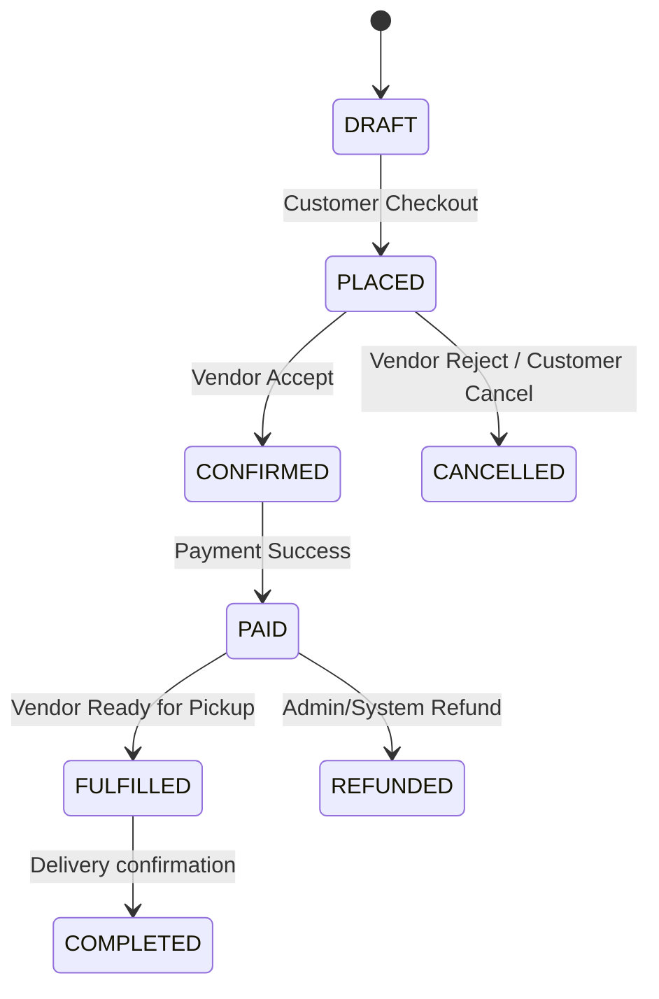
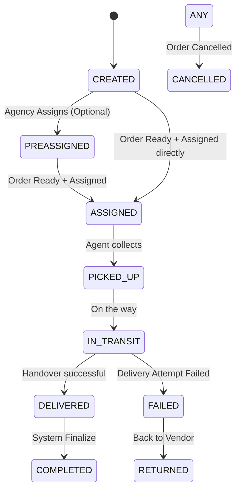

# System Architecture

## 1. System Overview

**Style:** Modular Monolith
**Core:** Node.js (TypeScript) + MongoDB
**Pattern:** Domain-Driven Design (DDD) with clear Bounded Contexts.

The system is designed as a single deployable unit (monolith) but structured internally as distinct modules (bounded contexts). This allows for strict separation of concerns, future extractability into microservices if needed, and clear data ownership.

### API Philosophy
- **Task-Oriented:** Endpoints represent actions (verbs), not just data resources.
  - GOOD: `POST /orders/place`, `POST /delivery/assign`
  - BAD: `POST /orders` (generic), `PATCH /delivery/{id}` (generic)
- **RESTful:** Uses standard HTTP verbs and status codes but focuses on domain intent.

---

## 2. Actors & Responsibilities

| Actor | Responsibilities | Key Access |
| :--- | :--- | :--- |
| **Admin** | System configuration, user management, global oversight. | metrics, users, suspensions, configs |
| **Vendor** | Product management, inventory, order processing (up to fulfillment). | catalog, own orders, payments (receivable) |
| **Customer** | Browsing, cart management, ordering, payment, tracking. | catalog, cart, orders, profile |
| **DeliveryAgency** | Managing fleet of agents, assigning deliveries, overseeing logistics. | agents, deliveries, agency profile |
| **DeliveryAgent** | Executing physical delivery options, updating status. | assigned deliveries, status updates |

> **Strict Boundary:** Delivery Agencies manage Agents. Vendors request delivery but do not manage Agents directly.

---

## 3. Bounded Contexts & Domain Responsibilities

Each module is self-contained. Communication between modules happens via public services or event bus (in-memory for now).

### 1. Auth
- **Scope:** Identity, Authentication, Authorization (RBAC).
- **Data:** `Users` (Credential store), `Sessions`.
- **Public API:** Login, Register, Refresh Token, Me.

### 2. Catalog
- **Scope:** Product data, Categories, Inventory (simple).
- **Data:** `Products`, `Categories`.
- **Owner:** Vendor (write), Customer (read).

### 3. Vendors
- **Scope:** Vendor profiles, Settings, Business rules.
- **Data:** `Vendors`.

### 4. Customers
- **Scope:** Customer profiles, Address checks, Favorites.
- **Data:** `Customers`, `Addresses`.

### 5. Orders
- **Scope:** Cart, Order placement, Order lifecycle management.
- **Data:** `Orders`, `OrderItems`.
- **Dependencies:** Catalog (price check), Customers (profile), Payments (status).

### 6. Payments
- **Scope:** Payment processing, Refund handling, Ledger.
- **Data:** `Payments`, `Transactions`.

### 7. Delivery
- **Scope:** Logistics, Shipping, Agencies, Shipment lifecycle.
- **Data:** `Deliveries`, `DeliveryAgencies`, `DeliveryStatusHistory`.
- **Note:** Agents were extracted into their own context (below) once they stopped being an
  agency-owned record.

### 7b. Agent
- **Scope:** The delivery agent as a platform identity — profile, account status, availability,
  working state, device capabilities, preferences/settings, the tracking-allow business flag,
  agent↔agency **contracts**, the trust score, and assignment eligibility.
- **Data:** `DeliveryAgents`, `AgentAgencyContracts`, `AgentMembershipEvents`,
  `ContractStatusRequests`, `ContractTermsProposals`.
- **Owner:** Agent (own record), Agency (per-contract terms — *negotiated*, not imposed),
  Admin (account status, KYC, platform ban, tracking, transfers).
- **Public surface:** `src/modules/agents/index.ts` — other modules import from the barrel, never
  from files inside it. Routes are the exception and are imported directly by the API layer (a
  router pulls in auth middleware, which imports the barrel — re-exporting routes closes a require
  cycle).

> **Why agents are their own context.** An agent is not owned by an agency: they sign up
> independently and may serve **several agencies at once**. The original model carried a single
> `DeliveryAgent.agency_id`, which cannot express "active at A, suspended at B". Anything that
> differs per agency (employment terms, coverage, the fee split, this contract's COD threshold,
> the relationship's own status) therefore lives on `AgentAgencyContract`; anything true of the
> person regardless of employer (identity, the trust score, the COD **pool**, capacity,
> availability, device, tracking permission) lives on the agent.
>
> **The rule for new agent fields:** if the value could differ per agency, it belongs on the
> contract.

> **The COD limit is a shared pool.** The agent owns one `cod.max_threshold`; each contract's
> `cod.threshold` is a sub-allocation of it, and the sum across allocating contracts can never
> exceed the agent's own limit. This replaced an *independent* per-agency cap
> (`cod.max_exposure_override`), under which three agencies could each grant 1M to an agent
> willing to hold 1M and the platform learned of the 3M of real exposure only when cash went
> missing. A pool cannot be over-committed by construction.
>
> **Contract statuses:** `pending · rejected · withdrawn · active · paused · suspended ·
> deactivated`. `approved` is an **action**, not a state — approving lands the row in `active`.
> `paused` and `suspended` still consume the pool (the agent may still hold that agency's cash),
> so reactivation can never fail a headroom check.
>
> **The email-invite subsystem is gone.** Agencies and agents find each other through a directory
> and contract through a symmetric request → accept/reject/withdraw flow; `AgentInvites` no longer
> exists as a collection or a concept.

> **The trust score is one number with two implementations, and only one is live.**
> `cod.trust_score` (delta model, written per event by `CodTrustService`) is what
> `CodExposureService` turns into a cash limit. `trust_signals.composite_score` — the five-factor
> nightly composite that is *meant* to replace it — is computed and stored but read by nothing that
> decides anything. See `CLAUDE.md` § Agent trust score for why the cutover has not happened.

#### Tracking ownership boundary (with the geo-tracker service)

| Service | Owns |
|---|---|
| jovi-mall | Whether tracking is **allowed** (`agent.tracking.allowed`) — business policy; and every **business event** (shipment actions and their outcomes) |
| geo-tracker | Tracking **execution** — connections, positions, fan-out, ETA; and the **spatial audit** (where an agent was when an action happened) |

`agent.last_known_tracking_state` is a **business-reference mirror**, not a position store. It exists
so operational screens can say "last seen 3 minutes ago" without a synchronous cross-service call.
It is stale by construction and no assignment rule reads it.

**Agent-action audit (Phase 6).** When an agent performs a shipment action — the COD delivery-code
`collect`, or an agency-driven pickup/delivery/return/cancel on the agent's shipment — jovi-mall emits
an `agent.action` event (via the tracking outbox) carrying the action, its outcome, and the actor. It
holds no location. geo-tracker receives it, captures the agent's latest GPS, and writes an **immutable**
audit row. The business event stays here; the spatial record stays there — `agent-action-audit.service.ts`
is the emitter, geo-tracker's `/webhooks/agent-actions` the sink.

#### Assignment eligibility

An agent may receive a shipment only when **all** hold: `active` account · an **`active` contract**
with the *dispatching* agency · `verified` KYC · no platform ban · `online` · tracking allowed ·
device location not disabled · under their concurrency ceiling. The contract rule is still keyed
`approved` on the wire (`membership_not_approved`) — the old vocabulary, kept for clients.

An agent may hold **several active shipments at once** — capacity bounds this, it does not forbid it,
and the count spans all agencies (capacity is a property of the person, not of one agency's view).

Device location is the one input jovi-mall cannot observe. It resolves through
`IAgentDeviceLocationProvider` so the rule never learns whether the answer came from the agent's app
or from geo-tracker; swapping providers is a change in `agent.bootstrap.ts` alone. The signal is
**tri-state** — `true` / `false` / `null` (unknown) — and `null` is never coerced to `false`:
defaulting unknown→false would make every agent ineligible the moment geo-tracker went down.

### 8. Notifications
- **Scope:** Email, SMS, Push notifications.
- **Trigger:** Event-driven (e.g., `ORDER_CONFIRMED` -> Send Email).

### 9. Integrations
- **Scope:** External webhooks, WhatsApp API, Third-party tools.

---

## 4. Lifecycles

### Order Lifecycle

### Delivery Lifecycle

**Rule:** `PREASSIGNED` allows agencies to plan ahead, but `ASSIGNED` requires the Order to be `FULFILLED` (Ready for Pickup) or at least `CONFIRMED` depending on strictness.

---

## 5. Data Ownership Rules

1.  **Shared Tables:** A module can directly `JOIN` another module's table via the creation of a new table.
2.  **Reference by ID:** Store `customerId` in `Orders` table; do not embed the full customer document (except snapshotting).
3.  **Data Snapshotting:** Critical data (Product Price at time of order, Address at time of delivery) MUST be copied to the `Order/Delivery` record to prevent corruption if the source changes later.
4.  **Database:** MongoDB. Collections named with prefix/context if helpful, or just clear nouns.
    - `users`
    - `vendors`
    - `customers`
    - `products`
    - `orders`
    - `payments`
    - `deliveries`
    - `delivery_agencies`
    - `delivery_agents`
    - `agent_agency_contracts` — an agent may serve several agencies; one row per relationship.
      Renamed from `agent_agency_memberships`; the model file and a few exported aliases still
      say "membership", and they are the same thing
    - `agent_membership_events` — append-only contract history (no update/delete by contract).
      Kept its original name deliberately; renaming an append-only evidence table buys nothing
    - `contract_status_requests` — the two-party approve/reject workflow for a status change
    - `contract_terms_proposals` — stages a terms change against a LIVE contract, so the agreed
      `fee_split` keeps applying while the change is pending

5.  **Append-only collections.** `agent_membership_events` (and any audit trail) exposes no update or
    delete path, and deliberately does **not** use `BaseRepository` — its soft-delete filter has no
    business on evidence. A correction is a new event, not an edit.

    ⚠ One event type is **declared and written by nothing**: `cod_limit_changed`.
    `AgentCodThresholdService.setContractThreshold` takes no actor and appends no event, unlike
    every other contract mutation — so a COD threshold change is the one contract write with no
    audit trail. Giving it one needs an `Actor` parameter threaded to the call site; tracked in
    `AGENT-CONTRACT-REFACTOR.md` § "Found while doing step 1".

---
