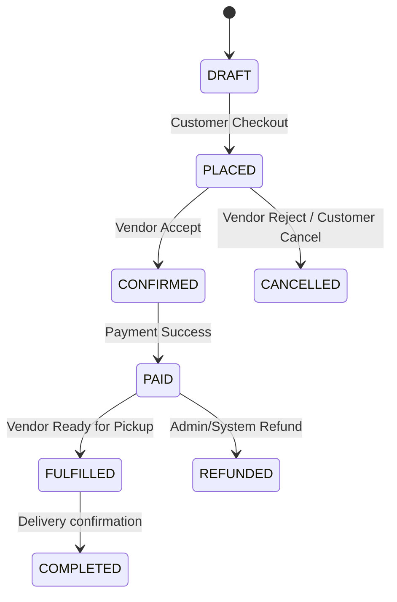
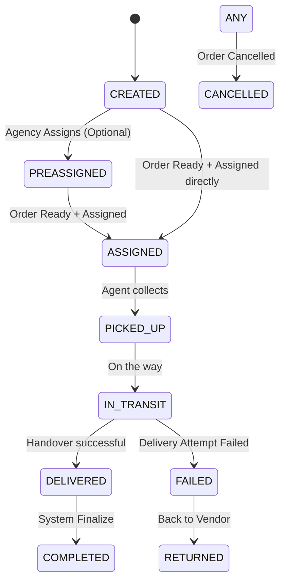

# System Architecture

## 1. System Overview

**Style:** Modular Monolith
**Core:** Node.js (TypeScript) + MongoDB
**Pattern:** Domain-Driven Design (DDD) with clear Bounded Contexts.

The system is designed as a single deployable unit (monolith) but structured internally as distinct modules (bounded contexts). This allows for strict separation of concerns, future extractability into microservices if needed, and clear data ownership.

### API Philosophy
- **Task-Oriented:** Endpoints represent actions (verbs), not just data resources.
  - GOOD: `POST /orders/place`, `POST /delivery/assign`
  - BAD: `POST /orders` (generic), `PATCH /delivery/{id}` (generic)
- **RESTful:** Uses standard HTTP verbs and status codes but focuses on domain intent.

---

## 2. Actors & Responsibilities

| Actor | Responsibilities | Key Access |
| :--- | :--- | :--- |
| **Admin** | System configuration, user management, global oversight. | metrics, users, suspensions, configs |
| **Vendor** | Product management, inventory, order processing (up to fulfillment). | catalog, own orders, payments (receivable) |
| **Customer** | Browsing, cart management, ordering, payment, tracking. | catalog, cart, orders, profile |
| **DeliveryAgency** | Managing fleet of agents, assigning deliveries, overseeing logistics. | agents, deliveries, agency profile |
| **DeliveryAgent** | Executing physical delivery options, updating status. | assigned deliveries, status updates |

> **Strict Boundary:** Delivery Agencies manage Agents. Vendors request delivery but do not manage Agents directly.

---

## 3. Bounded Contexts & Domain Responsibilities

Each module is self-contained. Communication between modules happens via public services or event bus (in-memory for now).

### 1. Auth
- **Scope:** Identity, Authentication, Authorization (RBAC).
- **Data:** `Users` (Credential store), `Sessions`.
- **Public API:** Login, Register, Refresh Token, Me.

### 2. Catalog
- **Scope:** Product data, Categories, Inventory (simple).
- **Data:** `Products`, `Categories`.
- **Owner:** Vendor (write), Customer (read).

### 3. Vendors
- **Scope:** Vendor profiles, Settings, Business rules.
- **Data:** `Vendors`.

### 4. Customers
- **Scope:** Customer profiles, Address checks, Favorites.
- **Data:** `Customers`, `Addresses`.

### 5. Orders
- **Scope:** Cart, Order placement, Order lifecycle management.
- **Data:** `Orders`, `OrderItems`.
- **Dependencies:** Catalog (price check), Customers (profile), Payments (status).

### 6. Payments
- **Scope:** Payment processing, Refund handling, Ledger.
- **Data:** `Payments`, `Transactions`.

### 7. Delivery
- **Scope:** Logistics, Shipping, Agent management, Tracking.
- **Data:** `Deliveries`, `DeliveryAgencies`, `DeliveryAgents`, `DeliveryStatusHistory`.

### 8. Notifications
- **Scope:** Email, SMS, Push notifications.
- **Trigger:** Event-driven (e.g., `ORDER_CONFIRMED` -> Send Email).

### 9. Integrations
- **Scope:** External webhooks, WhatsApp API, Third-party tools.

---

## 4. Lifecycles

### Order Lifecycle

### Delivery Lifecycle

**Rule:** `PREASSIGNED` allows agencies to plan ahead, but `ASSIGNED` requires the Order to be `FULFILLED` (Ready for Pickup) or at least `CONFIRMED` depending on strictness.

---

## 5. Data Ownership Rules

1.  **Shared Tables:** A module can directly `JOIN` another module's table via the creation of a new table.
2.  **Reference by ID:** Store `customerId` in `Orders` table; do not embed the full customer document (except snapshotting).
3.  **Data Snapshotting:** Critical data (Product Price at time of order, Address at time of delivery) MUST be copied to the `Order/Delivery` record to prevent corruption if the source changes later.
4.  **Database:** MongoDB. Collections named with prefix/context if helpful, or just clear nouns.
    - `users`
    - `vendors`
    - `customers`
    - `products`
    - `orders`
    - `payments`
    - `deliveries`
    - `delivery_agencies`
    - `delivery_agents`

---
