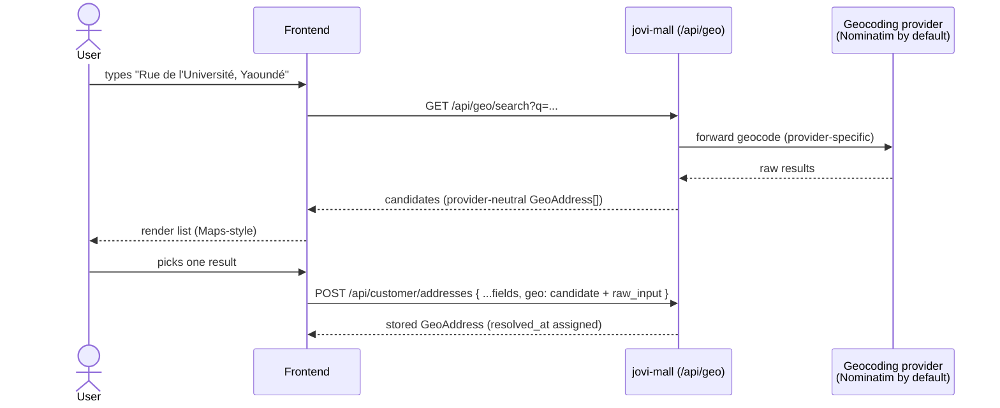

# Geospatial Addresses & Address Search

**Verified against source on 2026-09-06**, and the geocoding-ownership claim re-checked against
**geo-tracker's** Go source on **2026-09-08** (see the ⚠ at the foot of this page) — every claim
was checked against
`jovi-mall/src/`, including the whole inherited defect list that `vendor-dash` carried for it
(DOC-PROGRAM § 24–28). This page had gone stale against the 2026-08-23 provider-chain work;
corrections are marked inline with ⚠ and a source citation.

**Verified against source on 2026-09-08** (a re-check of the 2026-09-06 pass above) — the two routes (`GET /api/geo/search`,
`GET /api/geo/reverse`, `src/modules/geo/routes.ts:16,19`), the `q` / `limit` / `country` / `lang`
bounds (`src/modules/geo/validators/`), and every environment default in the table below
(`src/core/geocoding/geocoding.instance.ts:60-75`, `geocoding.factory.ts:145-160`). **One note on
this page was itself out of date** — see the ✅ under the provider chain.

> Provider-agnostic address search + the shared **GeoAddress** value object that every address in
> jovi-mall now carries. Users keep typing free-form text; the backend turns it into map-grade
> candidates via the active geocoding provider, and the selected candidate is stored with full
> geospatial data — never plain text alone.

All endpoints use the standard envelope (see [../README.md](../README.md)). Auth: **any signed-in role**.

---

## Why this exists

Addresses used to be loose text with, at most, a bare coordinate. There was no formatted address, no
provider place id, and no structured admin breakdown, and nothing turned typed text into map results.
Now:

- **Vendor** business addresses, **agency** headquarters, **customer** saved addresses, order
  **pickup** snapshots, and the order **drop-off** all embed a `GeoAddress`.
- A geocoding provider resolves free-form text to candidates. **Three adapters are built** —
  `nominatim` (the keyless default), `geoapify` and `locationiq` — and `GEO_PROVIDER=chain` runs
  them in a failover order, which is **the intended production setting**. Switching is a config
  change only; the API shape and every consumer stay identical. **No business logic ever depends
  on the provider.**

> ⚠ **This said "a single geocoding provider … only `nominatim` has an adapter in this build"
> until 2026-09-06, and it had been false since 2026-08-23.** `src/core/geocoding/providers/`
> holds `nominatim.provider.ts`, `geoapify.provider.ts` and `locationiq.provider.ts`, and
> `geocoding.chain.ts` is a fourth composite. A reader planning a deployment from this page would
> have concluded the platform was pinned to public OSM.

---

## The GeoAddress object

Stored verbatim wherever an address lives. `coordinates` is GeoJSON `[longitude, latitude]`.

```jsonc
{
  "formatted_address": "Rue de l'Université, Yaoundé, Cameroun",
  "coordinates": { "type": "Point", "coordinates": [11.5174, 3.8480] }, // [lng, lat]
  "provider": "nominatim",              // which provider resolved it (informational)
  "provider_place_id": "way:12345678",  // provider's stable id (nullable)
  "components": {                        // structured admin breakdown — every part nullable
    "street": "Rue de l'Université",
    "neighbourhood": "Ngoa-Ekellé",
    "city": "Yaoundé",
    "region": "Centre",
    "country": "Cameroon",
    "country_code": "CM",               // ISO-3166-1 alpha-2
    "postal_code": null
  },
  "raw_input": "Rue de l'Université, Yaoundé", // what the user typed before selecting
  "resolved_at": "2026-07-18T10:20:30.000Z"    // server-assigned on store
}
```

When you **store** a GeoAddress (attach it to a profile address, or send it at checkout), send exactly
the candidate you got from search **plus** `raw_input`. `resolved_at` is server-assigned — do not send it.

---

## Endpoints

### `GET /api/geo/search`

Turn free-form text into ranked candidate locations (the Google-Maps-style search box).

| Query | Type | Notes |
|---|---|---|
| `q` | string (required) | The free-form text the user typed. |
| `limit` | integer 1–20 | Max candidates. Provider default (5) when omitted. |
| `country` | string | Comma-separated ISO-3166-1 alpha-2 codes to bias results, e.g. `cm,ng`. Defaults to the platform bias (`GEO_DEFAULT_COUNTRY_CODES`, `cm`). |
| `lang` | string | Preferred result language, BCP-47 (e.g. `fr`). |

```jsonc
// GET /api/geo/search?q=Rue%20de%20l'Universit%C3%A9,%20Yaound%C3%A9&limit=5
{
  "success": true,
  "data": {
    "provider": "nominatim",
    "query": "Rue de l'Université, Yaoundé",
    "results": [
      {
        "formatted_address": "Rue de l'Université, Yaoundé, Cameroun",
        "coordinates": { "type": "Point", "coordinates": [11.5174, 3.8480] },
        "provider": "nominatim",
        "provider_place_id": "way:12345678",
        "components": { "street": "Rue de l'Université", "city": "Yaoundé", "region": "Centre", "country": "Cameroon", "country_code": "CM", "neighbourhood": null, "postal_code": null }
      }
      // …more candidates
    ]
  }
}
```

Each `results[]` entry is a **candidate** — the GeoAddress shape minus `raw_input`/`resolved_at`. To
store it, add `raw_input` (the user's `q`) and submit it to the owning endpoint (below).

### `GET /api/geo/reverse`

Turn a coordinate into its best-matching address (e.g. "use my current location").

| Query | Type | Notes |
|---|---|---|
| `lat` | number −90..90 (required) | Latitude. |
| `lng` | number −180..180 (required) | Longitude. |

```jsonc
// GET /api/geo/reverse?lat=3.8480&lng=11.5174
{ "success": true, "data": { "provider": "nominatim", "result": { /* one candidate, or null */ } } }
```

> ⚠ **There are TWO `provider` fields and they answer different questions.** Both responses carry
> one at the top of `data` and one inside every candidate, and under `GEO_PROVIDER=chain` they
> **disagree** — which is the configuration this platform is meant to run.
>
> | Field | What it is | Can it say `"chain"`? |
> |---|---|---|
> | `data.provider` | the **configured type**, straight from `GEO_PROVIDER` (`getGeocodingProviderType()` → `geocodingConfig.provider`, `geocoding.instance.ts:177-179`) | **Yes** — literally `"chain"` |
> | `data.results[].provider` · `data.result.provider` | the **service that actually resolved that candidate** | **Never** |
>
> The per-candidate one is the one that matters and the only one you may store: it is what
> `GeoAddress.provider` persists, and `'chain'` is **deliberately absent** from `GEO_PROVIDERS`
> (`geo-address.types.ts:44`) because a stored row saying "chain" records which *mechanism*
> answered instead of which *service*, making `provider_place_id` unresolvable forever
> (`geocoding.chain.ts:75-81`). The chain passes candidates through untouched.
>
> **So `data.provider` is diagnostic only.** Do not persist it, and do not assume the candidates
> below it came from it.

### Error codes

| `error.code` | Status | Meaning |
|---|---|---|
| `GEO_PROVIDER_RATE_LIMITED` | 429 | Out of quota / over the provider's rate limit (`geoapify.provider.ts:132`, `locationiq.provider.ts:143`). ⚠ **Under `chain` you will rarely see this** — it is a *failover* trigger, so the next provider answers instead and you get a `200`. It surfaces only when **every** member is rate-limited. |
| `GEO_PROVIDER_UNAVAILABLE` | 503 | Provider unreachable (network/timeout). Geo is off the critical path — retry; checkout/profile still work. Also a failover trigger under `chain`. |
| `GEO_SEARCH_FAILED` | 502 | Provider returned an error / unparseable response. ⚠ **NOT a failover trigger** — a malformed query is malformed everywhere, so the chain does not retry it. |
| `GEO_PROVIDER_NOT_CONFIGURED` | 500 | Configured provider has no adapter or no credentials in this build (`google`/`mapbox`/`here`, or a keyed provider with no key). |
| `CONFIG_INVALID_GEO_PROVIDER` | 500 | `GEO_PROVIDER` is a string that is not a provider name at all (`geocoding.factory.ts:123`). A misspelling fails loudly rather than silently running on the fallback. |
| `VALIDATION_ERROR` | 400 | Bad query params (missing `q`, out-of-range `lat`/`lng`). |

> ⚠ **`GEO_PROVIDER_RATE_LIMITED` and `CONFIG_INVALID_GEO_PROVIDER` were missing from this table
> until 2026-09-06**, and the failover column above did not exist. Which errors the chain absorbs
> and which it re-throws is the difference between a retry that helps and one that never will.
>
> ⚠ **A total outage surfaces as an ERROR, never as an empty result.** When every member fails
> the chain re-throws the last error (`geocoding.chain.ts:83-86`), because *"nobody could be
> asked"* and *"everybody said no"* are different answers and a client must be able to tell them
> apart. An empty `results: []` therefore genuinely means no match.
>
> ✅ **The chain default is `locationiq,geoapify` — LocationIQ FIRST — and both source comments
> now say so.** The order was **reversed by measurement on 2026-08-23** because the chain only
> consults the second provider when the first returns empty or errors: a first provider that
> answers *confidently and wrongly* is never corrected, while one that 429s is. The default array
> is `geocoding.factory.ts:153-155`; `geocoding.instance.ts:17-20` describes it. (This paragraph
> reported the instance comment as stale until 2026-09-08; it has since been corrected at source,
> and re-reading it was the only way to find that out.)

---

## Where a GeoAddress is stored

Attach the selected candidate (as a `geo` field, or as the checkout drop-off) to any of these. The
legacy loose fields (`address_line1`, `city`, `location`, …) are **kept** for backward compatibility;
`geo` is the canonical record.

| Site | Endpoint | Field |
|---|---|---|
| Customer saved address | `POST /api/customer/addresses` | `geo` |
| Vendor business address | `PATCH /api/vendor/profile` (and onboarding step 3) | `business_addresses[].geo` |
| Agency HQ address | agency onboarding step 1 / `PATCH /api/agency/magazin` | `headquarters_addresses[].geo` (`location`, `region` and `city` are all **derived** from it) |
| Pickup location | derived from the vendor business address; **snapshotted** onto the order at checkout | `items[].delivery.pickup_location.address_snapshot.geo` |
| Drop-off | `POST /api/customer/orders/checkout` | `deliveryAddress` **or** `deliveryAddressId` → snapshotted to `order.delivery_address` |

### Checkout drop-off

`POST /api/customer/orders/checkout` now accepts (physical carts):

```jsonc
{
  "paymentMethod": "online",
  // ONE of the two (or neither → falls back to the customer's default saved address):
  "deliveryAddressId": "665f...c1",     // id of one of the customer's saved addresses
  "deliveryAddress": { /* a selected GeoAddress + raw_input */ }
}
```

The resolved GeoAddress is frozen onto every order in the checkout group as `order.delivery_address`,
so a later edit to the customer's saved addresses never rewrites past orders. Digital orders ignore it.

---

## Workflow — type → search → select → store



## Workflow — drop-off snapshot at checkout

```mermaid
sequenceDiagram
    actor Customer
    participant FE as Frontend
    participant API as jovi-mall
    participant DB as MongoDB

    Customer->>FE: choose saved address or search a new one
    FE->>API: POST /api/customer/orders/checkout { deliveryAddressId | deliveryAddress }
    API->>API: resolve → GeoAddress (inline > addressId > default saved)
    API->>DB: create orders, freeze order.delivery_address (per order)
    API-->>FE: orders (each with durable geocoded drop-off)
    note over API,DB: geo-tracker may later read the drop-off coordinate for routing —<br/>no event-shape change; jovi-mall owns geocoding, geo-tracker owns routing.
```

---

## Provider configuration

Selected once at boot from env (see `.env.example`). Mirrors the storage-provider pattern.

| Env | Default | Notes |
|---|---|---|
| `GEO_PROVIDER` | `nominatim` | **`chain`** \| `nominatim` \| `geoapify` \| `locationiq` — these four work. `google` \| `mapbox` \| `here` are named seams with **no adapter**: the factory throws `GEO_PROVIDER_NOT_CONFIGURED` and the boot validator refuses the start (`config/env.ts:444`). |
| `GEO_PROVIDER_CHAIN` | `locationiq,geoapify` | **Only read when `GEO_PROVIDER=chain`.** The failover order (`geocoding.factory.ts:153-155`). **Keyless `nominatim` is always appended last** unless already named, so the chain can never come out empty. |
| `GEO_GEOAPIFY_API_KEY` | — | Required when `GEO_PROVIDER=geoapify` (boot error). In a **chain** a missing key **skips that provider with a warning** rather than failing the boot — that is what lets one setting serve a keyless laptop and a two-key production host. |
| `GEO_LOCATIONIQ_API_KEY` | — | Same rule as above. |
| `GEO_GEOAPIFY_BASE_URL` | Geoapify public | Or a self-hosted mirror. |
| `GEO_LOCATIONIQ_BASE_URL` | LocationIQ public | Or a self-hosted mirror. |
| `GEO_REQUEST_TIMEOUT_MS` | `5000` | Per-request timeout. |
| `GEO_DEFAULT_LIMIT` | `5` | Default candidate count. |
| `GEO_DEFAULT_COUNTRY_CODES` | `cm` | Comma-separated ISO-2 bias. Blank = worldwide. |
| `GEO_NOMINATIM_BASE_URL` | public OSM | Or a self-hosted mirror. |
| `GEO_NOMINATIM_USER_AGENT` | identifying UA | **Required by Nominatim's usage policy.** |
| `GEO_CACHE_ENABLED` | `true` | The result cache — see below. |
| `GEO_CACHE_TTL_SECONDS` | `86400` | How long a resolved result is kept. |
| `GEO_CACHE_NEGATIVE_TTL_SECONDS` | `600` | How long an empty result is kept — deliberately shorter. |
| `GEO_CACHE_REVERSE_PRECISION` | `4` | Decimals a reverse coordinate is rounded to (~11 m). |

### Results are cached, and a client cannot tell

Both endpoints are served through a Redis result cache
([ADR-A04](../../docs/ADR-A04-GEOCODING.md) D-1). **Nothing about the contract changes** — the
response shape, the `provider` field on every candidate, and the error codes are identical on a
hit and on a miss, and there is no cache header, no `cached: true` flag and no way to bypass it
from a request. Two things follow that are worth knowing anyway:

- **A repeated search is fast and free.** Typing the same street twice, or two customers typing
  it at all, costs one provider call. Do not build your own client-side cache on top of this one
  unless you are trying to save a network round trip rather than a provider call.
- **The cache fails open.** If Redis is unavailable the provider is called directly — an address
  search never fails *because* of the cache, and never hangs on it.

`GEO_CACHE_NEGATIVE_TTL_SECONDS` is the one number a client's behaviour can notice: an address
that returns no candidates is remembered for ten minutes by default, so an address added to
OpenStreetMap in the last few minutes may take that long to appear. It is short precisely so that
window stays short.

The seam is `IGeocodingProvider` (`src/core/geocoding/`). Adding Google/Mapbox/HERE/Geoapify is one
adapter file + a factory case; **no consumer changes**. Because geocoding is an address concern and
jovi-mall owns addresses, the whole provider abstraction **for the order and profile model** lives
in jovi-mall.

> ⚠ **This sentence ended "— geo-tracker owns live positions and road networks, not address
> resolution" until 2026-09-08, and that last clause is false.** geo-tracker exposes
> `GET /routing/geocode` and `GET /routing/reverse-geocode`, registered at
> `geo-tracker/internal/modules/routing/delivery/http/routes.go:17-18` and implemented against the
> live provider at `handler.go:122-160` — real calls, not stubs. Whether they answer depends on
> that service's own `ROUTING_PROVIDER`; its default `chain`
> (`geoapify,locationiq,osrm`) **can** geocode as soon as either key is set, and a keyless host
> falls back to OSRM alone and returns `501`. See
> [`geo-tracker/api-doc/routing.md`](../../../geo-tracker/api-doc/routing.md), which documented
> this correctly the whole time.
>
> **The narrower claim is the true one, and it is the one that matters here:** resolving an address
> *for an order or a profile* is jovi-mall's alone, and the `GeoAddress` value object above has no
> counterpart in geo-tracker. A client already authenticated to geo-tracker may legitimately use
> its geocoder — it simply must not be the thing that produces a stored `GeoAddress`.
