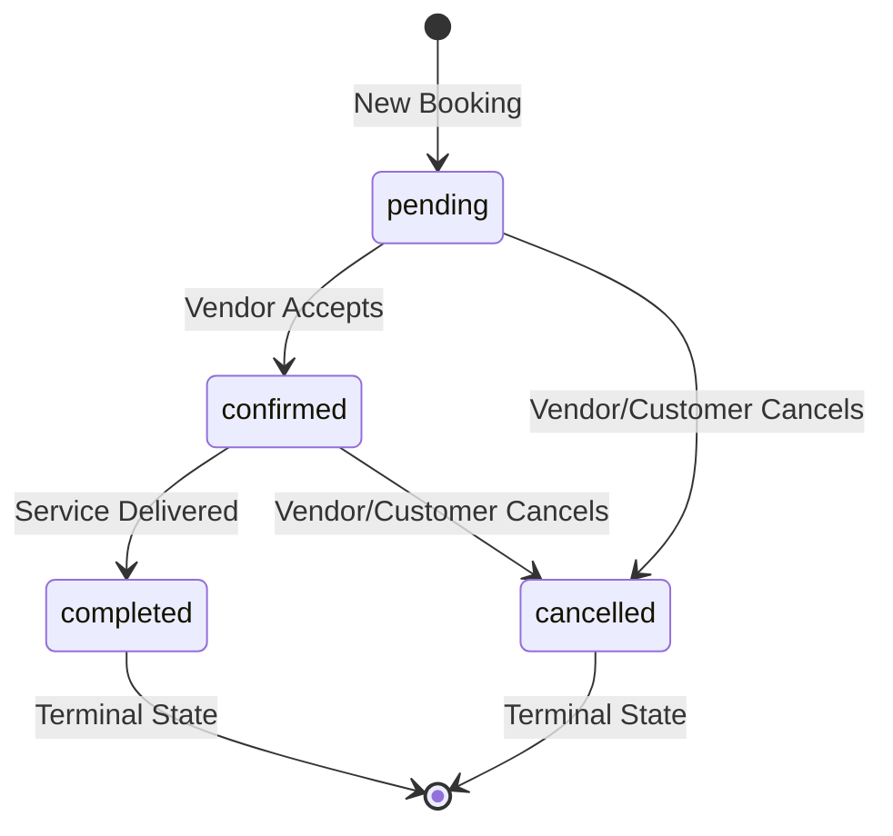

# Vendor Booking Management API

Complete API reference for managing bookings in the multi-vendor ecommerce platform.

> [!IMPORTANT]
> **Authentication Required**
> All endpoints require:
> - Bearer token in `Authorization` header
> - Vendor role
> - Vendor can only access their own bookings

---

## Table of Contents

- [List Bookings](#list-bookings)
- [Get Booking](#get-booking)
- [Update Booking Status](#update-booking-status)
- [Booking Status State Machine](#booking-status-state-machine)
- [Error Codes](#error-codes)

---

## List Bookings

```http
GET /api/vendor/bookings
```

List all bookings for the authenticated vendor with filtering and pagination.

**Query Parameters:**

| Parameter | Type | Required | Description |
|-----------|------|----------|-------------|
| `status` | string | No | Filter by status: `pending`, `confirmed`, `completed`, `cancelled` |
| `page` | number | No | Page number (default: `1`) |
| `limit` | number | No | Items per page (default: `20`, max: `100`) |

**Response:**

```json
{
  "success": true,
  "data": [
    {
      "_id": "507f1f77bcf86cd799439011",
      "productId": {
        "_id": "507f1f77bcf86cd799439012",
        "title": "1-Hour Consultation",
        "type": "service"
      },
      "userId": {
        "_id": "507f1f77bcf86cd799439013",
        "login_email": "customer@example.com"
      },
      "vendorId": "507f1f77bcf86cd799439014",
      "startAt": "2026-02-05T10:00:00.000Z",
      "endAt": "2026-02-05T11:00:00.000Z",
      "status": "confirmed",
      "paymentStatus": "paid",
      "paymentMethod": "online",
      "priceSnapshot": 50000,
      "currency": "XAF",
      "requiresPayment": true,
      "externalCalendarEventId": "abcd1234xyz",
      "metadata": {
        "notes": "First time customer"
      },
      "createdAt": "2026-02-01T14:30:00.000Z",
      "updatedAt": "2026-02-01T14:35:00.000Z"
    }
  ],
  "meta": {
    "total": 45,
    "page": 1,
    "limit": 20,
    "totalPages": 3
  }
}
```

**Response Fields:**

- `productId`: Populated with product details (title, type)
- `userId`: Populated with customer email
- `status`: Current booking status (see [state machine](#booking-status-state-machine))
- `paymentStatus`: Payment state (`unpaid`, `pending`, `paid`, `failed`, `refunded`)
- `externalCalendarEventId`: Google Calendar event ID (if synced)

---

## Get Booking

```http
GET /api/vendor/bookings/:id
```

Retrieve a single booking by ID.

**Response:**

```json
{
  "success": true,
  "data": {
    "_id": "507f1f77bcf86cd799439011",
    "productId": {
      "_id": "507f1f77bcf86cd799439012",
      "title": "1-Hour Consultation",
      "type": "service",
      "serviceConfig": {
        "durationMinutes": 60
      }
    },
    "userId": {
      "_id": "507f1f77bcf86cd799439013",
      "login_email": "customer@example.com"
    },
    "vendorId": "507f1f77bcf86cd799439014",
    "startAt": "2026-02-05T10:00:00.000Z",
    "endAt": "2026-02-05T11:00:00.000Z",
    "status": "confirmed",
    "paymentStatus": "paid",
    "priceSnapshot": 50000,
    "currency": "XAF",
    "requiresPayment": true,
    "externalCalendarEventId": "abcd1234xyz",
    "createdAt": "2026-02-01T14:30:00.000Z",
    "updatedAt": "2026-02-01T14:35:00.000Z"
  }
}
```

**Error Responses:**

- `404 NOT_FOUND`: Booking not found or doesn't belong to vendor

---

## Update Booking Status

```http
PATCH /api/vendor/bookings/:id/status
```

Update booking status with automatic calendar synchronization.

**Request Body:**

```json
{
  "status": "confirmed"
}
```

**Valid Status Values:**

- `pending`: Initial booking state (awaiting vendor confirmation)
- `confirmed`: Vendor has accepted the booking
- `completed`: Service has been delivered
- `cancelled`: Booking was cancelled

**Response:**

```json
{
  "success": true,
  "data": {
    "_id": "507f1f77bcf86cd799439011",
    "status": "confirmed",
    "externalCalendarEventId": "abcd1234xyz",
    ...
  },
  "message": "Booking status updated"
}
```

> [!NOTE]
> **Automatic Calendar Sync**
>
> When transitioning status, the system automatically:
> - **`pending` → `confirmed`**: Creates calendar event in vendor's Google Calendar
> - **`confirmed` → `cancelled`**: Deletes calendar event
>
> Calendar sync errors are logged but don't block the status update.

**Error Responses:**

**404 NOT_FOUND:**
```json
{
  "success": false,
  "error": {
    "code": "NOT_FOUND",
    "message": "Booking not found"
  }
}
```

**400 INVALID_TRANSITION:**
```json
{
  "success": false,
  "error": {
    "code": "INVALID_TRANSITION",
    "message": "Cannot transition from completed to confirmed",
    "details": "Allowed transitions: none (terminal state)"
  }
}
```

---

## Booking Status State Machine

The booking status follows a strict state machine with defined transitions:



**Allowed Transitions:**

| From State | To States |
|------------|-----------|
| `pending` | `confirmed`, `cancelled` |
| `confirmed` | `completed`, `cancelled` |
| `completed` | *(none - terminal)* |
| `cancelled` | *(none - terminal)* |

**Important Rules:**

- Once a booking reaches `completed` or `cancelled`, it cannot be changed
- Invalid transitions return `400 INVALID_TRANSITION` error
- State transitions trigger calendar sync when applicable

---

## Error Codes

| Code | HTTP Status | Description |
|------|-------------|-------------|
| `VALIDATION_ERROR` | 400 | Request validation failed (invalid status value) |
| `INVALID_TRANSITION` | 400 | Status transition not allowed by state machine |
| `NOT_FOUND` | 404 | Booking not found or doesn't belong to vendor |
| `INTERNAL_ERROR` | 500 | Unexpected server error |

**Error Response Format:**

```json
{
  "success": false,
  "error": {
    "code": "VALIDATION_ERROR",
    "message": "Invalid input",
    "details": [...]
  }
}
```

---

## Calendar Integration

Bookings are automatically synchronized with the vendor's Google Calendar:

**Calendar Event Details:**

- **Title**: `[UNPAID] Product Title` or `[FREE] Product Title`
- **Description**: Customer email, price, and booking notes
- **Color**: Based on payment status
  - Unpaid: Orange
  - Paid: Green
  - Failed: Red
  - Refunded: Gray

**Calendar Event Lifecycle:**

1. **Booking Creation** (`createBooking` service): Creates calendar event immediately
2. **Status: pending → confirmed**: Creates calendar event with booking details
3. **Status: confirmed → cancelled**: Deletes calendar event from vendor's calendar

> [!CAUTION]
> **Calendar Sync is Non-Blocking**
>
> If calendar synchronization fails (e.g., calendar not connected, API error), the booking status update still succeeds. Calendar errors are logged for debugging.

---

## Implementation Notes

1. **Vendor Ownership**: All operations enforce vendor ownership via `vendorId` from auth token
2. **Soft Delete**: Bookings respect `deletedAt` field (soft delete pattern)
3. **Pagination**: Default page size is 20, max is 100 items per page
4. **Populated Fields**: List and Get endpoints populate `productId` and `userId` for convenience
5. **Payment Status**: Separate from booking status - tracks payment lifecycle independently
6. **Calendar Sync**: Handled automatically by service layer, not exposed in API
7. **State Machine**: Enforced at service layer with clear error messages for invalid transitions
